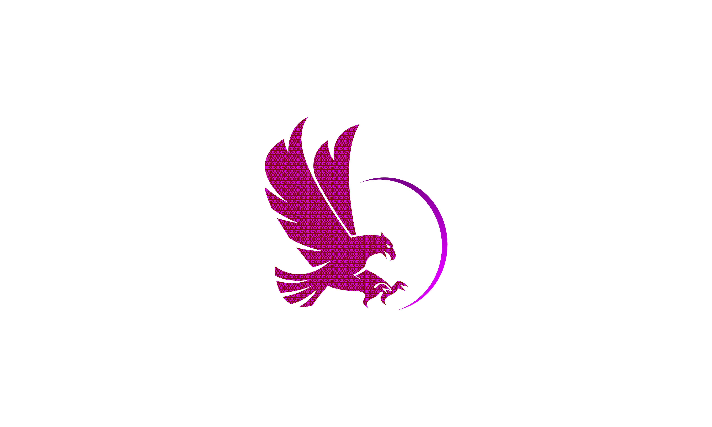

  

  
  
  

### Who We Are
We are a team of researchers, engineers, and competitive players dedicated to advancing the field of cybersecurity through hands-on research and knowledge sharing.

---
### What We Do
- [x] **Vulnerability Research:** Publish in-depth analyses of CVEs and exploit development techniques.
- [x] **Offensive Tooling:** Build and release open-source tools to aid in security assessments.
- [x] **Competitive Security:** Actively compete in Capture the Flag (CTF) events globally.
- [x] **Community Contribution:** Share knowledge and insights to strengthen the broader security community.

---
### Core Principles

| Principle          | Description                                           |
| ------------------ | ----------------------------------------------------- |
| **Depth First** | Go beyond the surface level to understand the root cause.   |
| **Signal Over Noise** | Prioritize high-quality, impactful work over visibility.      |
| **Growth Obsessed** | Embrace continuous learning and rapid adaptation.       |
| **Ethics Always** | Conduct all research responsibly and professionally.      |

---
### Contact
For questions, collaboration inquiries, or ideas, we're always open to discussion.
- 📧 **Email:** `contact@raptx.org`
- 🌐 **Website:** `raptx.org`

---
### Find Us Elsewhere

- **CTFtime:** [https://ctftime.org/team/357584](https://ctftime.org/team/357584)
- **HackTheBox:** [https://app.hackthebox.com/teams/overview/6565](https://app.hackthebox.com/teams/overview/6565)
- **LinkedIn:** [https://www.linkedin.com/company/raptx/](https://www.linkedin.com/company/raptx/)
- **X (Twitter):** [https://x.com/raptxsec/](https://x.com/raptxsec/)

---

  <strong>Security is our playground.</strong>

